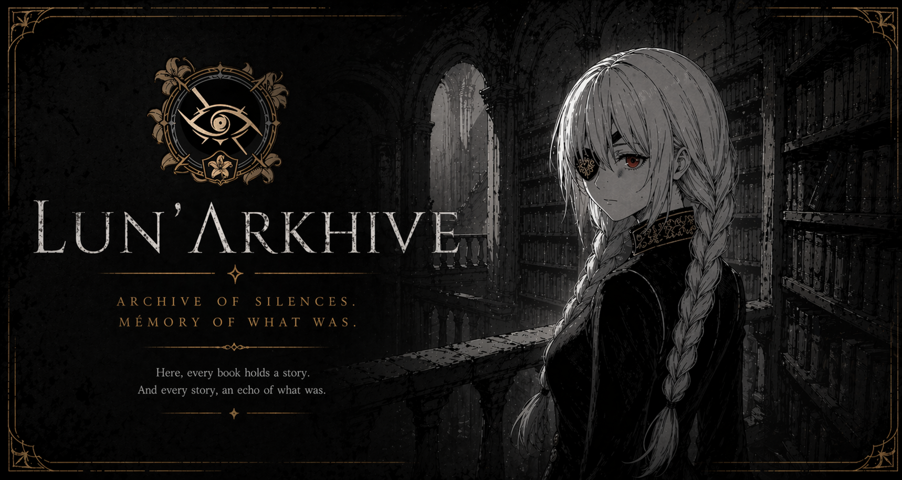
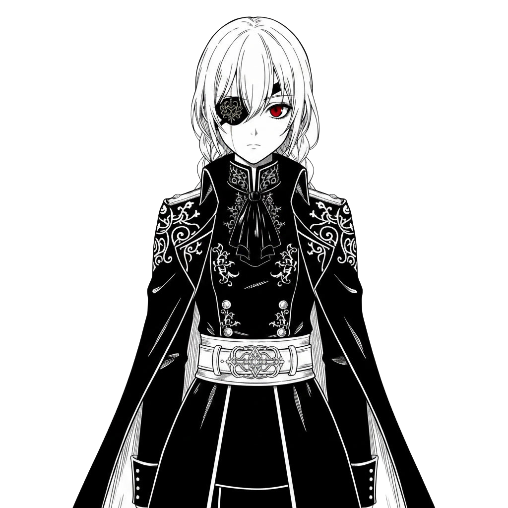

<div align="center">



[](.)
[](.)
[](.)

*An interactive archive. A persistent presence. A project that refused to stay private.*

</div>

---

## What this is

Welcome to Lun’Λrkhive !

It is the public face of **Project Natsume** — a private AI companion, a virtual assistant and ... some other stuffs.

This website is a experimental way to introduce at our universe.

> [!NOTE]
> If you came here looking for a standard developer portfolio, you are in the wrong place. If you came here because something felt different — keep going.

> [!WARNING]
> This repository contains the site source code only. The core project is private and will not be open-sourced. Visual assets (portraits, backgrounds, ornaments) are "original" works (yeah I now it's AI don't hit me please) — they are not covered by any open license and may not be reused.

---

## Natsume Tsurugi



"But with AI agents like Claude, is there really any point in this kind of project and ..."

Yep but CLaude can't declare my taxes. He even can't help me farm memoquartz.

So YES there are any point in this kind of project and it's not because I don't have friends ...


> [!NOTE]
> She love sweets, useful if she's mad at you.

<br clear="right" />

---

## The Project

A "local-first" AI companion framework. Built in TypeScript / Node.js.

The premise is simple: what if a character could persist? Not just respond — but remember, form opinions, notice your absence, disagree when she thinks you are wrong, and evolve her relationship with you over time.

```
Not just a chatbot who tel you if 2+2 + 4.
A persistent cognitive entity running 24/7 on local hardware.
```

**Core design decisions:**

| Principle | What it means |
|-----------|--------------|
| **Local-first** | LLM, TTS, STT all have local fallbacks — no cloud dependency for runtime |
| **Persistent identity** | Character, memory, and affinity survive across sessions |
| **Behavioral depth** | Proactivity, mood states, controlled disagreement, spontaneous speech |
| **Modular** | Every subsystem is independently swappable via environment variables |

> [!IMPORTANT]
> The memory system is not a conversation history. It is a multi-layer architecture — short-term buffer, long-term summaries, persistent facts with semantic retrieval, extracted opinions, and a cross-session world model. Natsume remembers what matters, not everything.

> [!IMPORTANT]
> Local-first is an architectural constraint, not a limitation. Every cloud provider has a local fallback. The system runs without internet access. Natsume's identity does not depend on an API being available.

**Capability overview:**

| Domain | Capabilities | Status |
|--------|-------------|--------|
| **Memory** | Short-term buffer · Long-term summaries · Persistent facts · Semantic retrieval · Opinion store | ✅ |
| **Behavior** | Emotional state engine · Affinity tiers · Idle speech · Absence decay · Stimulation score | ✅ |
| **Awareness** | Screen vision · Game hooks · Window context · Session modes | ✅ |
| **Expression** | Voice synthesis · RVC voice changer · VTube Studio avatar · Lip-sync | ✅ |
| **Stream** | Twitch adapter · YouTube adapter · Chat modes | ✅ |
| **Infrastructure** | SQLite / JSON storage · Resource manager · Session stats · Action audit | ✅ |
| **Admin panel** | Dashboard · Module control · Live logs | 🔄 v1.0.0 |

> [!WARNING]
> w-AI-fu is not designed for general use. It is built around a specific character, a specific person, and a specific relationship. Forking the architecture would not give you Natsume.

---

## Lunarca — The Archive

The site is not a demo of w-AI-fu. It is a translation of it.

w-AI-fu runs locally, privately, continuously. Lunarca takes what cannot be shown — the memory system, the behavioral depth, the relationship — and makes it *felt* through a different medium: a narrative web experience.

The user enters a library. Books are sections. Navigation is diegetic — no nav bar, no scroll, no conventional UI. Every interaction is a deliberate choice. Natsume is present throughout. She does not guide. She observes, reacts, occasionally speaks.

> [!NOTE]
> The constraint behind every design decision: technology should never overpower the atmosphere. If a feature makes the experience louder, it gets cut.

**Experience principles:**
- Calm, controlled pacing — no noise, no gamification
- Subtle interactions over explicit affordances
- Narrative tone inspired by contemplative RPGs
- Return visits are remembered

**Site stack:**

```
React 18 + Vite     SPA, hash routing, no routing library
CSS Modules         custom properties, no utility framework
Framer Motion       scene transitions, AnimatePresence
Plain JS            no TypeScript by design
```

**Artistic direction:**

```
Palette     monochrome cold — black, dark grey, off-white #f5f3ef
Accent      deep red — symbolic, reserved for Natsume's eye only
Linework    ink-based, franco-belgian BD influence
References  Ender Lilies × Gravity Rush × NieR:Automata
Assets      AI-generated, consistent style pipeline, all rights reserved
```

> [!TIP]
> The site is best experienced on desktop, in a dark environment, without rushing. It is not designed to be fast. It is designed to be remembered.

---

## Status

Active development. The framework (w-AI-fu) is ahead of the archive (Lunarca).

**w-AI-fu** — `v0.11.0` · persistent storage, SQLite backend, embedding persistence

**Lunarca** — `v0.1.0` · core scenes functional, narrative content in progress

Current focus:
- Narrative writing — dialogues, section texts, devlog entries
- UI component refinement — ornamental frame system, DevlogBook redesign
- Visual consistency across all scenes

> [!NOTE]
> The devlog inside Lunarca is a live record of both projects. It updates as they evolve.

→ **[lunarca-archive.vercel.app](https://lunarca-archive.vercel.app)**

---

## Project Structure

```
Lunarca (this repo — public)
├── Site source — React + Vite
├── Assets — backgrounds, portraits, ornaments, books
└── Narrative data — dialogues, devlog, scene content

w-AI-fu (private repository)
├── Framework core — TypeScript / Node.js
├── Character definition — Natsume_Tsurugi.json
└── User data — memory, facts, opinions, world model
```

> [!CAUTION]
> The assets directory is public by necessity — the site needs to load them. This does not make them free to use. All visual assets are original works protected under All Rights Reserved. Do not reuse, redistribute, or repurpose them.

---

<div align="center">

Built by **[CrOliX-AltF4](https://github.com/CrOliX-AltF4)**

*Exploring the intersection of narrative design, character identity, and web development.*

© 2025–2026 Loric Worms — All Rights Reserved

</div>