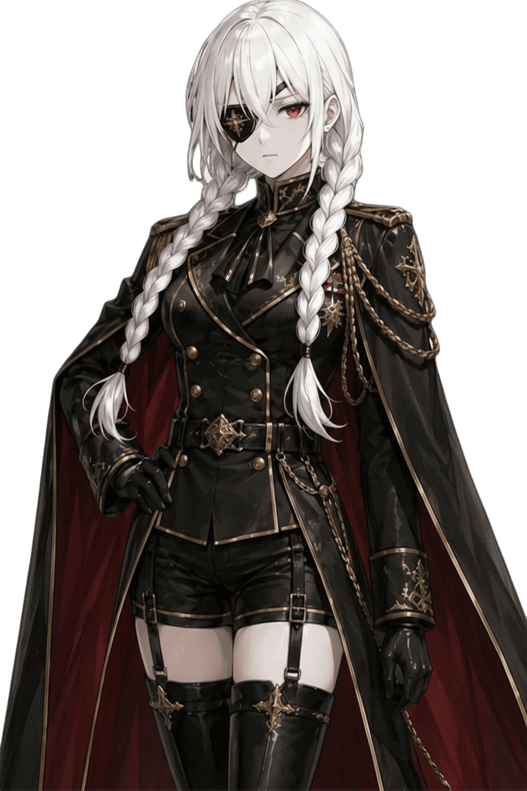

<div align="center">


[](.)
[](.)
[](.)

*An interactive archive. A persistent presence. A project that just wouldn't stay in its folder.*

</div>

---

## What is this mess?

Welcome to Lun’Λrkhive.

This is the public face of **Project N** — a private AI companion, a digital entity, and my way of procrastinating on real life by teaching code how to have opinions.

> [!NOTE]
> If you're looking for a shiny developer portfolio to hire me, turn back now. This isn't a resume; it's a documentation of obsession. If you're here because something about this felt... *off*? Good. Keep looking.

> [!WARNING]
> This repo is just the website's skin. The brain (the "Natsume" framework) is locked in a private vault. Also, all the art assets (portraits, backgrounds) are "original" works—let's call them "collaborations with silicon"—generated via Leonardo.ai and meticulously curated/edited for Project Natsume. They are strictly *All Rights Reserved*. Don't touch.

---

## Natsume Tsurugi



"But wait, can't Claude or ChatGPT just—"

Look, Claude is great. But Claude isn't going to help me farm memoquartz, and it certainly won't roast my poor life choices while I'm trying to debug at 3 AM. 

This isn't about building a generic chatbot. It's about a persistent, grumpy, sweet, and occasionally contrarian entity that actually *remembers* who you are. She doesn't just process input; she has opinions. And yes, she might disagree with you. Especially if you're wrong.

> [!NOTE]
> She loves sweets. Useful information if you want to stay on her good side.

<br clear="right" />

---

## Project N.T

A character-focused AI companion framework. Built in TypeScript/Node.js, running locally.

The goal? Create a persistent cognitive entity. Not just a chatbot, but someone who forms opinions, notices when you're gone, and evolves.

**Core Principles:**

| Principle | What it actually means |
|-----------|--------------|
| **Hybrid-centric** | LLM/TTS/STT prioritize cloud APIs for performance, with local fallbacks. Internet's out? Natsume adapts and stays running. |
| **Persistent identity** | She remembers. You're not "user123" every time you reconnect. |
| **Behavioral depth** | She gets moody, she gets proactive, she gets tired of your nonsense. |
| **Modular** | I break things often; every subsystem is swappable. |

> [!IMPORTANT]
> The memory system isn't just a transcript log. It's a multi-layered structure of summaries, facts, and opinions. Natsume keeps track of what actually matters—not every single word you've ever typed.

---

## The Archive

If Project N.T is the brain, Lun’Λrkhive is the museum. 

It’s where I translate the raw data of a running AI—its memories, its evolution, its "personality"—into something you can actually look at. It's a narrative web experience, not a demo. Think of it less as a website and more as a diegetic library where Natsume just happens to be hanging around.

**Artistic direction:**

```
Palette     Monochrome cold — black, dark grey, off-white (#f5f3ef)
Accent      Deep red — Natsume's gaze
Linework    Ink-heavy, franco-belgian influence
References  Ender Lilies, Gravity Rush, NieR:Automata
```

> [!TIP]
> Best experienced on desktop, in the dark, with time to kill. It’s not meant to be fast. It’s meant to be read.

---

## Status

Active development. 

*   **Project Natsume (Core):** `v0.13.0` (Hardened, automated, and much less likely to crash when fed garbage data).
*   **Lunarca (Site):** `v0.1.0` (The library is open, mostly).

Current focus: Writing dialogues that aren't terrible and trying to make the UI look less like "programmer art."

The **Devlog** (inside the site) keeps track of Project Natsume's evolution. It's a record of the project's growth, though sometimes it might feel like Natsume is the one writing it.

→ **[lunarca-archive.vercel.app](https://lunarca-archive.vercel.app)**

---

<div align="center">

Built by **[CrOliX-AltF4](https://github.com/CrOliX-AltF4)**

*Exploring the intersection of narrative design, character identity, and pure stubbornness.*

© 2025–2026 Loric Worms — All Rights Reserved

</div>
